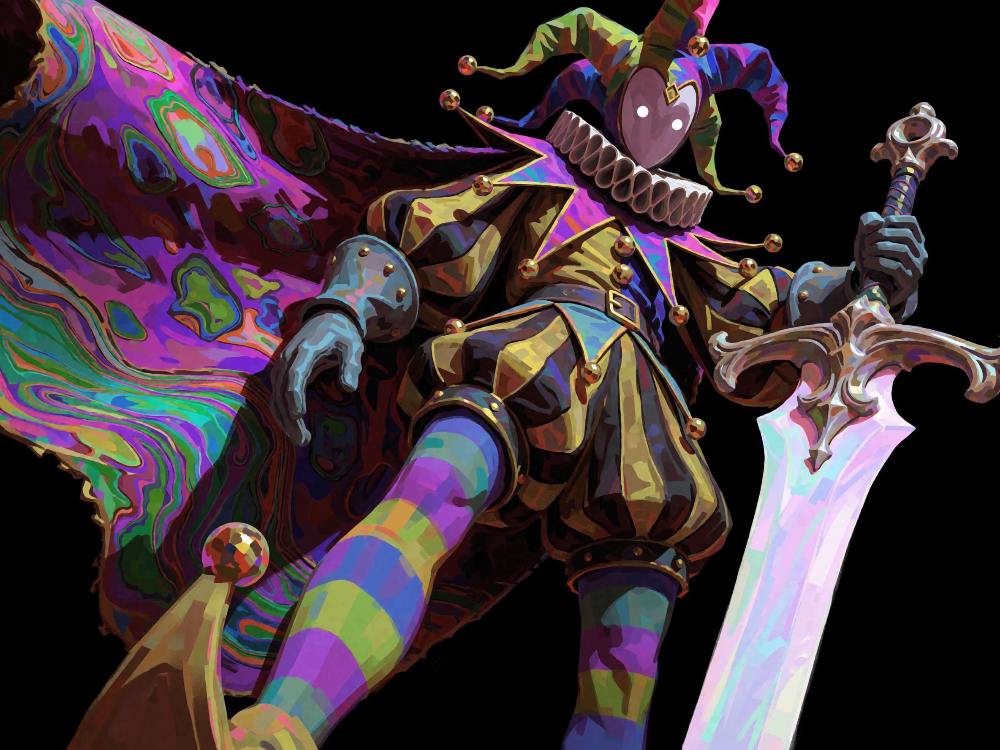

# Prompting guidelines

We recommend users to use natural language prompts to generate images.
The turbo model can generate up to 2k resolution images. Long detailed prompts yield best results, but the model is capable of generating high quality images with minimal prompt engineering. For text rendering, we recommend putting quotes around the words to be rendered.
If you wish to use LLM assistance for generating longer prompts, check out [expansion.txt](expansion.txt) and use it as a system prompt for LLM of your choice.

## Examples

All examples are generated at 2k resolution with the turbo model.

`immense rocket launch exhaust as seen from extremely close up`

 

`3D rendered matte black designer toy figure, stylized round anthropomorphic shape, backward black baseball cap, oversized gold-rimmed aviator sunglasses, white traditional line-art tattoos of tiger and bird on torso, black studded belt with gold buckle, smooth vinyl texture, studio lighting, solid vibrant blue background, high contrast minimal composition`

 

`vintage analog collage, central irregularly shaped snowy mountain range with a section featuring distinct wavy edges, structured within a 12x16 grid of square tiles, composition fragments the subject by alternating tiles with solid azure blue background squares, thin white grid lines, grainy paper texture, retro aesthetic of mid-century print, vibrant cyan and warm neutral tones, experimental layout, tactile quality, high-contrast graphic composition`

 

`close-up anime portrait of a young woman, large amber-brown eyes with intricate sparkling reflections, index finger delicately touching a subtle smile, messy dark blue hair with loose strands crossing her face, white and navy school uniform, bright high-key lighting, luminous shadows with cool blue undertones, detailed digital painting, dynamic tilted framing, shallow depth of field on hand`

 

`A minimalist flat-color illustration of a person wading through expansive shallow ocean waves beneath a pale peach sky. The dark-skinned figure, wearing an orange swim cap, light blue top, and bright green shorts, steps carefully through knee-deep water. The ocean is rendered in muted mint green with delicate, thin black linework detailing the continuous ripples and gentle whitecaps. Soft pinkish-peach reflections echo the sky on the water's surface. A dark, jagged rock rests in the lower left foreground near a pale grey shoreline. The horizon features a solid purplish-blue landmass and a stylized, layered yellow and blue cloud. The high-angle wide perspective emphasizes the vast negative space of the water, utilizing a clean ligne claire drawing aesthetic with a subtle paper texture.`

 

`A tiny figure and a small white dog sit side-by-side in the deep green shadow of a massive tree on a sloping grassy hill. The enormous tree canopy dominates the upper composition, textured with thousands of stippled, light blue and yellow dabs representing leaves. A sharp diagonal line divides the vibrant, sunlit yellow-green grass in the foreground from the dark shade sheltering the pair. The stylized, painterly landscape features flattened perspective, visible brushstrokes, and intense color contrast.`

 

`A close-up portrait of a young East Asian woman with straight black hair, loose strands sweeping across her fair skin, and an intense gaze. She wears a light grey collared shirt with a black tie. A vibrant bouquet of pink and orange lilies with lush green leaves sits in the blurred right foreground. The background is a solid, striking crimson red. Soft, directional studio lighting highlights her facial features, creating a high-contrast composition with a shallow depth of field.`

 

`A tiny, russet-brown harvest mouse clings to a slender diagonal branch amid vibrant green lobed leaves and small round buds. The mouse has soft textured fur, glossy black eyes, a pink nose, fine whiskers, and delicate pink paws firmly gripping the wood. In this macro photograph, an extremely shallow depth of field sharply focuses on the animal's face. The deep green background dissolves into a smooth, creamy bokeh, illuminated by soft, diffused natural lighting that highlights the intricate details of the fur and foliage.`

 

`A dynamic digital painting of a joyful girl in a sailor uniform stretching her arms high against a solid vibrant blue background. She has short dark windblown hair, amber eyes, and a bright smile. She wears a white shirt, striped blue collar, flowing red neckerchief, and a billowing blue pleated skirt. Expressive thick brushstrokes and bold shading emphasize energetic motion.`

 

`stylized digital painting of a dark convertible on a winding coastal cliff road, high-angle perspective, blocky painterly brushstrokes, golden hour sunlight hitting rocky orange terrain and green vegetation, flock of white abstract birds flying in foreground, blinding bright sun reflection on vast ocean, vibrant warm color palette, sharp graphic shadows`

 

`An extreme low-angle close-up captures a colossal, weathered stone and bronze guardian towering in a dark, cavernous ruin. The foreground is dominated by a massive circular shield, deeply engraved with intricate spiral motifs, geometric borders, and a central star emblem. To the right, a massive gauntlet grips a textured staff. Cinematic shafts of light pierce the dusty gloom, highlighting the rough, aged textures of the ancient armor while the background fades into deep shadows through a shallow depth of field.`

 

`A stylized jungle illustration densely packed with oversized flora and surreal characters, rendered with smooth geometric shapes and granular stippled shading. Two pale figures with flowing, star-speckled black hair navigate the lush environment in blue garments. On the left, a figure grasps a vine as a white, long-beaked bird perches on their outstretched hand. On the right, the second figure reclines beside a sleek, pinkish-orange fox. The dense surroundings feature sweeping green stalks and colossal blooms in brilliant golden yellow, coral pink, and deep red. A second white bird emerges from the lower foliage. The vibrant composition forms a seamless tapestry, utilizing rich colors and volumetric grain to create a dreamlike, textured depth.`

 

`A surreal retro-futuristic space scene features liquid chrome forming an abstract face merging with a glowing planetary horizon. The foreground is dominated by swirling, highly reflective metallic fluid that distorts into a stylized, melting facial profile with deep shadows and bright silver highlights. This undulating chrome form rests against the curved, atmospheric edge of a massive planet bathed in a soft electric blue and purple glow. Above the primary planet, a smaller eclipsed celestial sphere sits in the upper center, crowned by a sharp, cross-shaped starburst flare. Two additional radiant flares burst from the left and right edges of the horizon. Set against a deep black starfield, the artwork employs a vintage 1980s airbrush aesthetic with smooth gradients, ethereal lighting, and high-contrast metallic rendering.`

 

`An extreme close-up portrait featuring pale, freckled skin and a single blue eye wrapped in reflective metallic gold ribbons. Thin gold strips crisscross diagonally over the cheek and forehead, casting sharp, hard shadows onto the face. Strands of copper hair frame the top edge while the left ear softly blurs out of focus. Harsh, direct lighting highlights intricate skin pores and bright golden reflections, isolating the brightly lit features against a pitch-black background in a bold, high-contrast macro editorial style.`

 

`Stylized digital painting of a menacing jester figure rendered with bold, expressive brushstrokes and a vibrant, almost psychedelic color palette against a pitch-black background. Dynamic low-angle perspective forces a dramatic, imposing composition as the character leans forward, one leg raised high. The jester wears a classic multi-pointed hat with bells, a ruffled collar, puffed sleeves, harlequin-patterned shorts in muted gold and dark brown, and striped tights in alternating shades of purple, blue, and chartreuse. A heavily textured, flowing cape billows outward to the left, decorated with abstract, fluid patterns of saturated purples, greens, and iridescent hues resembling oil slicks or marbled paper. The figure's face is completely obscured, appearing as a smooth, faceless, pale mauve mask with a single, glowing bright white point of light in the center. In its right hand, clad in a grey-blue gauntlet, the jester grips a massive, ornate sword with a wide, glowing, ethereal white blade, its crossguard intricately sculpted. Lighting is dramatic and theatrical, casting strong shadows and highlighting the painterly texture, giving the artwork a dark fantasy, surreal aesthetic reminiscent of concept art.`

 

`high-fashion editorial portrait of a young East Asian woman, short choppy platinum blonde bob with heavy bangs, looking over her bare shoulder to the right, lips playfully pursed, wearing a structured black top with an architectural protruding bust detail and thin straps, delicate gold hoop earrings, arm bent with hand resting on hip, warm skin tones, solid striking crimson red background, soft directional studio lighting, cinematic color palette, medium close-up shot`

 

`A surreal black-and-white ink illustration of three interlocking, heavily wrinkled elderly faces merging into a landscape. The top face covers one eye, crowned by dense leaves, a live bird, and a skeletal bird. It flows into a profile face and a third face featuring a solid black eye and a hand on its cheek. The bottom neck plunges into a cross-section of earth, morphing into swirling subterranean roots, buried bones, and abstract organic forms. Above ground, weathered wooden cabins and tall grass flank the facial monolith. Meticulous stippling and cross-hatching define the high-contrast, intricate vertical composition.`

 

`1990s vintage anime style cel animation, densely packed crowd of teenagers in summer uniforms, central boy with short black hair raising a clenched right fist, squinting one eye with a determined expression, wearing a white short-sleeve shirt and solid green necktie, surrounding students looking in various directions, girls in white sailor blouses with green striped collars and neckerchiefs, light blue skirts and trousers, tightly framed medium shot, flat shading, soft muted retro.`

 

`young woman looking over her right shoulder, anime-style illustration, messy black hair blowing dynamically in the wind, striking green eyes, subtle neutral expression, oversized white button-down collared shirt with soft blue shadows, vibrant deep blue sky background, bright fluffy white cumulus clouds, silhouetted utility poles with power lines, low angle portrait, cinematic sunlight, crisp cel-shaded aesthetic`

 

`extreme close-up of a woman's face partially obscured by tousled dark brown hair, soft parted lips, smooth skin on lower cheek and jawline, stray hair strands falling loosely across the nose, deep moody shadows enveloping the left frame, cinematic warm lighting, delicate highlights on the mouth, muted earthy color palette, sepia-toned warmth, intimate portrait photography, macro lens, shallow depth of field, distinct film grain texture, vintage atmospheric aesthetic`

